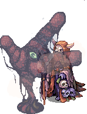
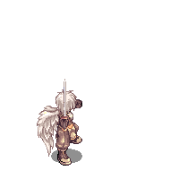

# zrenderer

Tool to render sprites from the game Ragnarok Online. This tool is available as either a webservice or as a CLI tool.

##### Table of contents
* [Required Resources](#required-resources)
* [Usage](#usage)
  * [CLI](#cli)
    * [Example](#example)
  * [Server](#server)
    * [API](#api)
      * [Request](#request)
      * [Response](#response)
      * [Example](#example-1)
* [Docker](#docker)
* [Dependencies when building](#dependencies-when-building)
  * [Linux](#linux)
  * [Windows](#windows)
* [Building](#building)
  * [CLI](#cli-1)
  * [Server](#server-1)
  * [Extra step for Windows](#extra-step-for-windows)

## Required Resources
Please see [RESOURCES.md](https://github.com/zhad3/zrenderer/blob/main/RESOURCES.md).

## Usage
### CLI
`./zrenderer -h`
```
A tool to render sprites from Ragnarok Online
-c                --config Specific config file to use instead of the default. Default: zrenderer.conf
-o                --outdir Output directory where all rendered sprites will be saved to. Default: output
            --resourcepath Path to the resource directory. All resources are tried to be found within this directory. Default: 
-j                   --job Job id(s) which should be rendered. Can contain multiple comma separated values. Default: 
-g                --gender Gender of the player character. Possible values are: male or female. Default: male
                    --head Head id which should be used when drawing a player. Default: 1
                  --outfit The alternative outfit for player characters. Not all characters have alternative outfits. In these cases the default character will be rendered instead. Value of 0 means no outfit. Default: 0
                --headgear Headgears which should be attached to the players head. Can contain up to 3 comma separated values. Default: 
                 --garment Garment which should be attached to the players body. Default: 0
                  --weapon Weapon which should be attached to the players body. Default: 0
                  --shield Shield which should be attached to the players body. Default: 0
-a                --action Action of the job which should be drawn. Default: 0
-f                 --frame Frame of the action which should be drawn. Set to -1 to draw all frames. Default: -1
             --bodyPalette Palette for the body sprite. Set to -1 to use the standard palette. Default: -1
             --headPalette Palette for the head sprite. Set to -1 to use the standard palette. Default: -1
                 --headdir Direction in which the head should turn. This is only applied to player sprites and only to the stand and sit action. Possible values are: straight, left, right or all. If 'all' is set then this direction system is ignored and all frames are interpreted like any other one. Default: all
            --enableShadow Draw shadow underneath the sprite. Default: true
            --singleframes Generate single frames of an animation. Default: false
   --enableUniqueFilenames If enabled the output filenames will be the checksum of input parameters. This will ensure that each request creates a filename that is unique to the input parameters and no overlapping for the same job occurs. Default: false
     --returnExistingFiles Whether to return already existing sprites (true) or always re-render it (false). You should only use this option in conjuction with 'enableUniqueFilenames=true'. Default: false
                  --canvas Sets a canvas onto which the sprite should be rendered. The canvas requires two options: its size and an origin point inside the canvas where the sprite should be placed. The format is as following: <width>x<height>±<x>±<y>. An origin point of +0+0 is equal to the top left corner. Example: 200x250+100+125. This would create a canvas and place the sprite in the center. Default: 
                   --hosts Hostnames of the server. Can contain multiple comma separated values. Default: localhost
                    --port Port of the server. Default: 11011
                 --logfile Log file to write to. E.g. /var/log/zrenderer.log. Leaving it empty will log to stdout. Default: 
-h                  --help This help information.
```
Options _hosts_, _port_ and _logfile_ are ignored for the CLI tool.
### Example
If not otherwise specified the requested sprites will be renderered as an APNG animation of the first action (0, Stand).

**Render monster with id 1001 (Scorpion) with action 0 (Stand, default)**  
`./zrenderer --job=1001`  
Result: 

**Render frame 10 of the monster with id 1870 (Necromancer) of action 16 (Attack)**  
`./zrenderer --job=1870 --action=16 --frame=10`  
Result: 

**Render character with id 4012 (Sniper), action 17 (Sit) while looking to the left (indicated by frame 2)**  
`./zrenderer --job=4012 --action=17 --frame=2`  
Result: 

**Render character with id 1 (Swordman), action 32 (Ready) with headgears 4 (Flower), 125 (Blush), garment 1 (Wings), weapon 1 (Sword), head 4 and gender female.**  
`./zrenderer --job=1 --headgear=4,125 --garment=1 --weapon=2 --head=4 --gender=female --action=32`  
Result: 

**Render character with id 0 (Novice), action 93 (Attack) with garment 1 (Wings), weapon 1 (Sword), head 15, gender male**  
**and place the sprite in a canvas of size 200x200px at x=75 and y=175.**  
`./zrenderer --job=0 --head=15 --bodyPalette=1 --weapon=2 --garment=1 --gender=male --action=93 --canvas=200x200+75+175`  
Result:

| Image border |
| --- |
|  |

## Server
`./zrenderer-server -h`
```
Same as CLI
```
The server will listen on the _hosts_, bind to _port_ and write its logs to _logfile_.

You can find the openApi specifications here: [OpenAPI specifications](https://github.com/zhad3/zrenderer/tree/main/server/api-spec).

### API
The server will provide one API endpoint:

| Endpoint | Method | Content-Type |
| --- | --- | --- |
| /render | POST | application/json |

#### Request
The endpoint accepts a request in json format with the following attributes:

| Attribute | Required | Type |
| --- | --- | --- |
| job | Yes | string array |
| action | No | number >= 0 |
| frame | No | number |
| gender | No | number: [0, 1]. 0=female, 1=male |
| head | No | number >= 0 |
| outfit | No | number >= 0 |
| garment | No | number >= 0 |
| weapon | No | number >= 0 |
| shield | No | number >= 0 |
| bodypalette | No | number |
| headpalette | No | number |
| headdir | No | number: [0, 1, 2, 3]. 0=straight, 1=left, 2=right, 3=all |
| enableshadow | No | boolean |
| canvas | No | string |
| headgear | No | number > 0 array |

Note that the attribute names are identical to the options one and so is their function and meaning as well as defaults.

#### Response
The following responses may be returned by the server

| HTTP Status | Content-Type | Body | Description |
| --- | --- | --- | --- |
| 200 | application/json | `{"output": ["out/0/1-0.png", "out/1002/1.png", ...]}` | JSON Object with one attribute called "output". The output attribute contains an array of filenames of the generated sprites. |
| 400 | application/json | `{"statusMessage": "<error message>"}` | Returned when the request is invalid. |
| 500 | application/json | `{"statusMessage": "<error message>"}`  | Returned when an error occurred. |

#### Example

`POST /render`
```json
{
    "job": ["1001", "1005"],
    "action": 16,
    "frame": 2
}
```
`200 OK`
```json
{
    "output": [
        "output/1001/16-2.png",
        "output/1005/16-2.png"
    ]
}
```
## Docker
You can use the pre-built and published images to run the server.

In a terminal run the following command to get up and running:

```
docker run -d --name zrenderer \
  -v ./zrenderer.docker.conf:/home/zrenderer/zrenderer.conf \
  -v ./output:/home/zrenderer/output \
  -v ./my-resources:/home/zrenderer/resources \
  -p 11011:11011 \
  zrenderer:latest
```

You will need to provide three directory/files:
- A configuration file (see the example `zrenderer.docker.conf`)
- The output directory where the server will store the images
- The resource directory where all the assets from Ragnarok Online reside in

## Dependencies when building
When building for the first time libpng and lua5.1 will be compiled which require a c-compiler.

## Linux
`binutils`, `autoconf`, `libtool`, `zlib`, `openssl`.

When available choose the dev versions of the packages.

## Windows
[Build Tools for Visual Studio](https://visualstudio.microsoft.com/downloads/#build-tools-for-visual-studio-2019)

## Building
From within the root directory of this project you can build the CLI and the Server.
### CLI
Run `dub build :cli`.
### Server
Run `dub build :server`.

### Extra step for Windows:
The above commands must be executed in the [Visual Studio Developer Command Prompt](https://docs.microsoft.com/en-us/visualstudio/ide/reference/command-prompt-powershell)
which will be available when installing the Build Tools for Visual Studio (see above).

Depending on your system the command prompt will be available for x86 and x64. Whichever you choose will build zrenderer for the same architecture.

---
All Ragnarok Online related media and content are copyrighted © by Gravity Co., Ltd & Lee Myoungjin(studio DTDS) and have all rights reserved.
